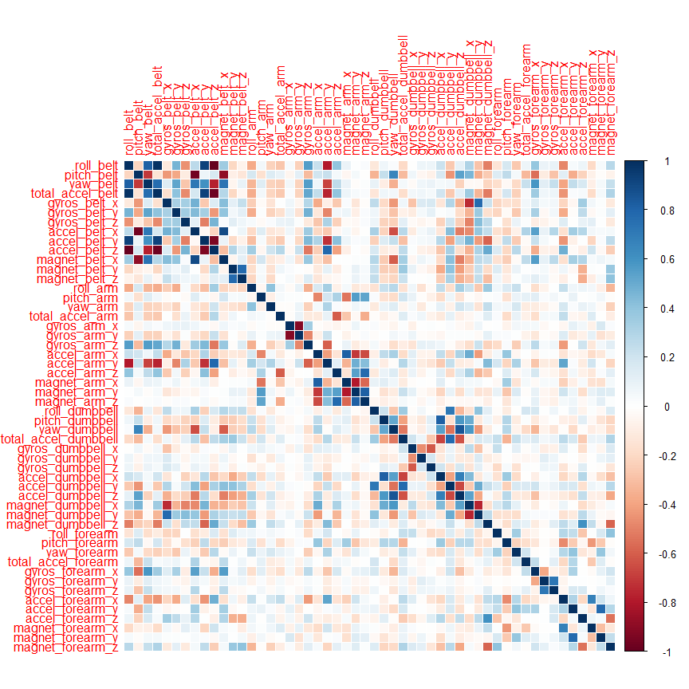
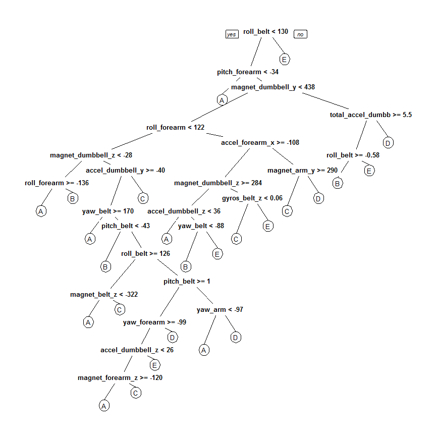

# Practical Machine Learning - Quantified Self Movement Data Analysis Report
Khaled Abdou  

## Introduction  
Using devices such as Jawbone Up, Nike FuelBand, and Fitbit it is now possible to collect a large amount of data about personal activity relatively inexpensively. These type of devices are part of the quantified self movement – a group of enthusiasts who take measurements about themselves regularly to improve their health, to find patterns in their behavior, or because they are tech geeks. One thing that people regularly do is quantify how much of a particular activity they do, but they rarely quantify how well they do it.  

In this project, the goal is to use data from accelerometers on the belt, forearm, arm, and dumbell of 6 participants. They were asked to perform barbell lifts correctly and incorrectly in 5 different ways. More information is available from the website here: http://groupware.les.inf.puc-rio.br/har (see the section on the Weight Lifting Exercise Dataset).  

## Data Preprocessing  

```r
library(caret)
```

```
## Warning: package 'caret' was built under R version 3.1.3
```

```
## Loading required package: lattice
```

```
## Warning: package 'lattice' was built under R version 3.1.3
```

```
## Loading required package: ggplot2
```

```
## Warning: package 'ggplot2' was built under R version 3.1.3
```

```r
library(rpart)
```

```
## Warning: package 'rpart' was built under R version 3.1.3
```

```r
library(rpart.plot)
```

```
## Warning: package 'rpart.plot' was built under R version 3.1.3
```

```r
library(randomForest)
```

```
## Warning: package 'randomForest' was built under R version 3.1.3
```

```
## randomForest 4.6-10
## Type rfNews() to see new features/changes/bug fixes.
```

```r
library(corrplot)
```

```
## Warning: package 'corrplot' was built under R version 3.1.3
```
### 1. Download the Data

```r
trainUrl <-"https://d396qusza40orc.cloudfront.net/predmachlearn/pml-training.csv"
testUrl <- "https://d396qusza40orc.cloudfront.net/predmachlearn/pml-testing.csv"
trainFile <- "./data/pml-training.csv"
testFile  <- "./data/pml-testing.csv"
if (!file.exists("./data")) {
  dir.create("./data")
}
if (!file.exists(trainFile)) {
  download.file(trainUrl, destfile=trainFile, method="curl")
}
if (!file.exists(testFile)) {
  download.file(testUrl, destfile=testFile, method="curl")
}
```
### 2. Read the Data
Read the csv files into two data frames.  

```r
trainRaw <- read.csv("./data/pml-training.csv")
testRaw <- read.csv("./data/pml-testing.csv")
dim(trainRaw)
```

```
## [1] 19622   160
```

```r
dim(testRaw)
```

```
## [1]  20 160
```
There are 19622 observations and 160 variables in Training data set.

There are 20 observations and 160 variables in the  testing data set.

The "classe" variable in the training set is the outcome to predict. 

### 3. Clean the data
Clean the data and remove observations with missing values and meaningless variables.

```r
sum(complete.cases(trainRaw))
```

```
## [1] 406
```
A. Remove columns that contain NA missing values.

```r
trainRaw <- trainRaw[, colSums(is.na(trainRaw)) == 0] 
testRaw <- testRaw[, colSums(is.na(testRaw)) == 0] 
```
B. Remove columns that do not contribute to the accelerometer measurements.

```r
classe <- trainRaw$classe
trainRemove <- grepl("^X|timestamp|window", names(trainRaw))
trainRaw <- trainRaw[, !trainRemove]
trainCleaned <- trainRaw[, sapply(trainRaw, is.numeric)]
trainCleaned$classe <- classe
testRemove <- grepl("^X|timestamp|window", names(testRaw))
testRaw <- testRaw[, !testRemove]
testCleaned <- testRaw[, sapply(testRaw, is.numeric)]
```
C. 
Training data set now contains 19622 observations and 53 variables.

Testing data set now contains 20 observations and 53 variables.

The "classe" variable is still in the cleaned training set.

### 4. Slice the data
cleaned training set is split into a pure training data set (70%) and a validation data set (30%). validation data set is used in cross validation in coming steps.  

```r
set.seed(22519) # For reproducibile purpose
inTrain <- createDataPartition(trainCleaned$classe, p=0.70, list=F)
trainData <- trainCleaned[inTrain, ]
testData <- trainCleaned[-inTrain, ]
```

## 5. Model the data
A. A predictive model for activity recognition is fit using **Random Forest** algorithm because; reason is it automatically selects relvent variables and is robust to correlated covariates & outliers. **5-fold cross validation** is used when applying the algorithm.  

```r
controlRf <- trainControl(method="cv", 5)
modelRf <- train(classe ~ ., data=trainData, method="rf", trControl=controlRf, ntree=250)
modelRf
```

```
## Random Forest 
## 
## 13737 samples
##    52 predictor
##     5 classes: 'A', 'B', 'C', 'D', 'E' 
## 
## No pre-processing
## Resampling: Cross-Validated (5 fold) 
## Summary of sample sizes: 10989, 10989, 10991, 10990, 10989 
## Resampling results across tuning parameters:
## 
##   mtry  Accuracy   Kappa      Accuracy SD  Kappa SD   
##    2    0.9910462  0.9886729  0.001301269  0.001647776
##   27    0.9914102  0.9891334  0.001717547  0.002174708
##   52    0.9850037  0.9810264  0.002718384  0.003439965
## 
## Accuracy was used to select the optimal model using  the largest value.
## The final value used for the model was mtry = 27.
```
B. An estimation of  the performance of the model on the validation data set.  

```r
predictRf <- predict(modelRf, testData)
confusionMatrix(testData$classe, predictRf)
```

```
## Confusion Matrix and Statistics
## 
##           Reference
## Prediction    A    B    C    D    E
##          A 1672    1    0    0    1
##          B    7 1128    4    0    0
##          C    0    0 1021    5    0
##          D    0    0   14  949    1
##          E    0    0    1    7 1074
## 
## Overall Statistics
##                                          
##                Accuracy : 0.993          
##                  95% CI : (0.9906, 0.995)
##     No Information Rate : 0.2853         
##     P-Value [Acc > NIR] : < 2.2e-16      
##                                          
##                   Kappa : 0.9912         
##  Mcnemar's Test P-Value : NA             
## 
## Statistics by Class:
## 
##                      Class: A Class: B Class: C Class: D Class: E
## Sensitivity            0.9958   0.9991   0.9817   0.9875   0.9981
## Specificity            0.9995   0.9977   0.9990   0.9970   0.9983
## Pos Pred Value         0.9988   0.9903   0.9951   0.9844   0.9926
## Neg Pred Value         0.9983   0.9998   0.9961   0.9976   0.9996
## Prevalence             0.2853   0.1918   0.1767   0.1633   0.1828
## Detection Rate         0.2841   0.1917   0.1735   0.1613   0.1825
## Detection Prevalence   0.2845   0.1935   0.1743   0.1638   0.1839
## Balanced Accuracy      0.9977   0.9984   0.9903   0.9922   0.9982
```

```r
accuracy <- postResample(predictRf, testData$classe)
accuracy
```

```
##  Accuracy     Kappa 
## 0.9930331 0.9911872
```

```r
oose <- 1 - as.numeric(confusionMatrix(testData$classe, predictRf)$overall[1])
oose
```

```
## [1] 0.006966865
```
C. The estimation accuracy of the model is 99.42% with estimated out-of-sample error of 0.58%.

## 5. Predicting for Test Data Set
The model is applied to the original downloaded testing data set. the `problem_id` column is removed.  

```r
result <- predict(modelRf, testCleaned[, -length(names(testCleaned))])
result
```

```
##  [1] B A B A A E D B A A B C B A E E A B B B
## Levels: A B C D E
```

## Appendix: Figures
1. Correlation Matrix Visualization  

```r
corrPlot <- cor(trainData[, -length(names(trainData))])
corrplot(corrPlot, method="color")
```

 
2. Decision Tree Visualization

```r
treeModel <- rpart(classe ~ ., data=trainData, method="class")
prp(treeModel) # fast plot
```

 
